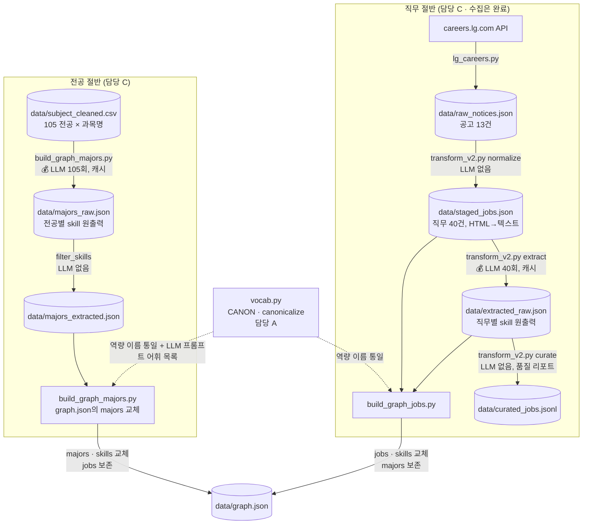
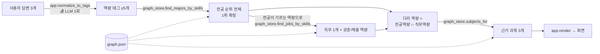

# 프로젝트 설명서 — 역량 경로 추천 (전공 ↔ 역량 ↔ LG CNS 직무)

> 처음 합류한 팀원도 **코드를 열지 않고 이 문서만으로** 구조·의도·데이터 흐름을 이해할 수 있게 쓴 문서입니다.
> 코드가 바뀌면 이 문서도 같이 고쳐 주세요. (기준: 2026-09-15 저장소 상태)

---

## 목차

0. [이 문서를 읽는 법](#0-이-문서를-읽는-법)
1. [프로젝트 한눈에 보기](#1-프로젝트-한눈에-보기)
2. [꼭 알아야 할 핵심 아이디어 5가지](#2-꼭-알아야-할-핵심-아이디어-5가지)
3. [전체 흐름도](#3-전체-흐름도)
4. [폴더·파일 구조와 담당](#4-폴더파일-구조와-담당)
5. [데이터 파일 사전](#5-데이터-파일-사전)
6. [모듈별 상세 설명](#6-모듈별-상세-설명)
7. [함수 연결 지도 — 누가 누구를 부르나](#7-함수-연결-지도--누가-누구를-부르나)
8. [점수 계산 방식 (실제 숫자로)](#8-점수-계산-방식-실제-숫자로)
9. [실행 가이드](#9-실행-가이드)
10. [현재 수치 · 알려진 한계 · 다음 할 일](#10-현재-수치--알려진-한계--다음-할-일)
11. [처음 보는 Python 문법 모음](#11-처음-보는-python-문법-모음)
12. [용어집](#12-용어집)

---

## 0. 이 문서를 읽는 법

| 상황 | 읽을 곳 |
|---|---|
| 프로젝트가 뭔지 5분 안에 알고 싶다 | 1장, 3장 |
| "통제 어휘", "raw/extracted", "허브"가 무슨 말인지 모르겠다 | 2장, 12장 |
| 어떤 파일이 어떤 파일을 만드는지 헷갈린다 | 3장 흐름도, 5장 |
| 특정 `.py` 파일을 고쳐야 한다 | 6장의 해당 절 + 7장 |
| 점수가 왜 이렇게 나오는지 모르겠다 | 8장 |
| 실행했는데 에러가 난다 | 9장 |
| Python 문법이 낯설다 | 11장 |

---

## 1. 프로젝트 한눈에 보기

### 무엇을 만드는가

**사용자의 자유 서술 답변 3개 → (서울대 전공 1개, 근거 과목 3개, LG CNS 직무 1개, 부족한 역량)** 을 추천하는 서비스입니다.

```
Q1 관심 있는 분야나 하고 싶은 일을 자유롭게 적어주세요.
Q2 스스로 잘한다고 생각하는 것은 무엇인가요?
Q3 다음 중 더 끌리는 쪽은? ① 데이터를 파고들어 패턴 찾기 ② 시스템을 설계하고 만들기 ③ 사람과 일정을 조율해 프로젝트 굴리기
```

↓ (실행 결과 예시 — `app.py`)

```
[프로필]  Data Analysis · Statistics · Machine Learning

[전공]    서울대학교 통계학과
          63개 전공 중 IT 역량이 검출된 56개를 비교한 결과 1위
          1.00 통계학과 / 1.00 첨단융합학부 / 1.00 융합학습과학전공

[과목]
          데이터마이닝 방법 및 실습 → Data Analysis  [서울대 개설]
          실험계획 및 실습 → Data Analysis  [서울대 개설]
          함수추정의 응용 및 실습 → Data Analysis  [서울대 개설]

[직무]    LG CNS Consulting (신입)
          요구 역량 2개 중 1개 커버
          ✓ Data Analysis
          ✗ 교과 밖에서 채울 것 — Cloud
```

### 왜 "그냥 ChatGPT에 물어보기"와 다른가 (발표 5장의 핵심)

| 우리 출력에만 있는 문장 | 챗봇이 못 하는 이유 |
|---|---|
| "63개 전공 중 … 1위" (**전수 순위**) | 챗봇은 전체 중에서 고르지 않는다. 떠오른 서너 개 중에 고를 뿐. |
| "요구 역량 2개 중 1개 커버, ✗ Cloud" (**커버리지 갭**) | 세어본 적이 없다. 집합 뺄셈(`직무역량 - 전공역량`)으로만 나온다. |
| "[서울대 개설]" (**출처 꼬리표**) | 지어낸 과목명에는 붙일 출처가 없다. |
| 같은 뜻의 답변 2개 → 같은 전공 (**재현성**) | 판정을 LLM이 아니라 딕셔너리 조회가 하므로 결과가 흔들리지 않는다. |

### 데이터 출처

| 데이터 | 출처 | 규모 |
|---|---|---|
| 서울대 교육과정 (전공명·과목명) | 대학알리미 공시 xlsx → `data/subject_cleaned.csv` | 105개 전공, 3,829개 과목 |
| LG CNS 채용공고 | careers.lg.com 내부 API → `data/raw_notices.json` | 공고 13건 → 직무 40건 |
| 역량 이름 (통제 어휘) | 팀이 직접 관리 → `vocab.py` | 대표 표기 63개 / 별칭 119개 |

---

## 2. 꼭 알아야 할 핵심 아이디어 5가지

### 아이디어 ① 지식그래프 = "노드 3종 + 엣지 2종"

```
(:Major 전공) --DEVELOPS {via: [과목명]}--> (:Skill 역량) <--REQUIRES / PREFERS-- (:Job 직무)
   서울대 63개                                 52개 (허브)                      LG CNS 22개
```

- **Major(전공)** 는 **Skill(역량)** 을 기른다. 엣지에 "어느 과목에서"(`via`)가 붙는다.
- **Job(직무)** 은 **Skill(역량)** 을 요구(`requires`)하거나 우대(`prefers`)한다.
- 전공과 직무는 **직접 연결되지 않는다.** 반드시 Skill을 거쳐 2홉으로 만난다.

Neo4j 같은 그래프 DB를 쓰지 않고 **`graph.json` 하나 + Python 딕셔너리**로 구현했습니다. 노드 3종·2홉이면 딕셔너리 조회가 더 빠르고 단순하기 때문입니다. (Neo4j·임베딩은 "확장 과제"로 발표)

> CS 연결: 그래프 순회 = 집합 교집합. `전공이 기르는 Skill ∩ 직무가 요구하는 Skill` 이 곧 "이 전공에서 이 직무로 가는 길"입니다.

### 아이디어 ② Skill은 허브다 → "통제 어휘(controlled vocabulary)"가 생명

전공 쪽이 `"머신러닝"`이라 쓰고 직무 쪽이 `"Machine Learning"`이라 쓰면 **같은 역량인데 다른 노드**가 되어 영원히 만나지 못합니다.
그래서 **역량 이름은 `vocab.py`의 `CANON` 사전에 등록된 대표 표기만** 쓸 수 있습니다.

```python
canonicalize("머신러닝")          # → "Machine Learning"   (별칭 → 대표 표기)
canonicalize("Machine Learning")  # → "Machine Learning"   (대표 표기 자기 자신)
canonicalize("Terraform")         # → None  (사전에 없으면 그래프에 못 올라간다)
canonicalize("생성형 AI를 활용한 프로젝트 경험이 있으신 분")  # → None (문장이다)
```

- LLM에게도 "이 목록 안에서만 골라라"고 시키고, 그래도 벗어나면 코드에서 한 번 더 거릅니다 (**2중 방어**).
- 사전에 없는데 이름처럼 생긴 것은 버리지 않고 **"CANON 추가 후보"**로 리포트해서 A(어휘 담당)가 판단합니다.

### 아이디어 ③ 오프라인(배치)과 온라인(실시간)은 완전히 분리된다

| | 오프라인 (그래프 만들기) | 온라인 (추천하기) |
|---|---|---|
| 언제 | 데이터가 바뀔 때 한 번 | 사용자가 질문할 때마다 |
| 스크립트 | `lg_careers.py`, `transform_v2.py`, `build_graph_*.py` | `app.py`, `graph_store.py` |
| LLM 호출 | 직무 40회 + 전공 105회 (**돈이 든다**, 캐시됨) | 1회 (답변 → 태그) |
| 산출물 | `data/graph.json` | 화면 출력 |

온라인 쪽은 `graph.json`만 읽습니다. 오프라인 파이프라인을 몰라도 `app.py`를 고칠 수 있습니다.

### 아이디어 ④ "판정"은 LLM이 아니라 도구(딕셔너리 조회)가 한다

`app.py`에서 LLM이 하는 일은 딱 하나 — **사용자 문장을 역량 태그로 바꾸는 것**입니다.
"어느 전공을 추천할지, 어느 직무가 맞는지, 무엇이 부족한지"는 전부 `graph_store.py`의 순수 Python 함수가 계산합니다.

→ 같은 태그면 항상 같은 결과. 이것이 **확인 항목 1번(재현성)**이 통과하는 이유입니다.

### 아이디어 ⑤ LLM 원출력은 파일에 캐시하고, 필터는 따로 돌린다 (3층 보관)

```
raw (LLM 원출력, 필터 전)  →  extracted (필터 통과분)  →  graph.json
 ★ 돈이 든다, 커밋 대상        0원, 몇 초, 매번 재계산        최종
```

필터 규칙(검증 규칙)을 고칠 때마다 LLM을 다시 부르면 시간과 돈이 낭비됩니다.
**원출력을 파일로 남겨 두면** 규칙을 고치고 재실행해도 캐시에 없는 것만 LLM을 부릅니다.

| 층 | 직무 쪽 | 전공 쪽 |
|---|---|---|
| raw | `data/extracted_raw.json` | `data/majors_raw.json` |
| extracted | `data/curated_jobs.jsonl` (품질 리포트용) | `data/majors_extracted.json` |
| graph | `data/graph.json` (`jobs`) | `data/graph.json` (`majors`) |

> ⚠ `extracted_raw.json`, `majors_raw.json`은 **지우지 마세요.** 지우면 다음 실행에서 LLM을 전부 다시 부릅니다(전공 105회 ≈ 40분).

---

## 3. 전체 흐름도

### 3-1. 오프라인 파이프라인 (graph.json 만들기)



### 3-2. 온라인 파이프라인 (추천하기)



**계산 순서 ≠ 출력 순서** — 화면은 전공 → 과목 → 직무 순이지만, 계산은 전공 → **직무** → 과목 순입니다.
과목을 먼저 뽑으면 "무슨 기준으로 3개를 고를지"가 없어서 뒤의 직무와 무관한 과목이 나옵니다. **과목은 전공과 직무를 잇는 다리**로 마지막에 뽑습니다.

---

## 4. 폴더·파일 구조와 담당

```
LG-CNS-KG-Project-1/
├── data/                        ← 데이터 전부. 코드에서 DATA / "파일명" 으로 참조
│   ├── subject_cleaned.csv      서울대 교육과정 (입력, 사람이 만든 것)
│   ├── raw_notices.json         LG careers API 응답 원본           ← lg_careers.py
│   ├── staged_jobs.json         공고 → 직무 단위로 펼침 (LLM 없음)   ← transform_v2.py normalize
│   ├── extracted_raw.json       직무별 LLM 원출력 캐시 ★           ← transform_v2.py extract
│   ├── curated_jobs.jsonl       정규화·검증 결과 + 품질 리포트       ← transform_v2.py curate
│   ├── majors_raw.json          전공별 LLM 원출력 캐시 ★           ← build_graph_majors.py
│   ├── majors_extracted.json    필터 통과분 (raw에서 재계산)        ← build_graph_majors.py
│   └── graph.json               최종 그래프 (skills / majors / jobs) ← build_graph_*.py
│
├── vocab.py                 A   통제 어휘 (CANON, canonicalize)   ★ 가장 중요한 파일
├── lg_careers.py            —   공고 수집 (완료. 다시 돌릴 일 거의 없음)
├── transform_v2.py          —   공고 → 직무 데이터 가공 (normalize / extract / curate)
├── build_graph_jobs.py      C   직무 절반 → graph.json
├── build_graph_majors.py    C   전공 절반 → graph.json  (LLM: 전공당 1회)
├── graph_store.py           B   graph.json 조회 함수 (LLM 없음)
├── app.py                   D   온라인 파이프라인 (질문 3개 → 전공·과목·직무)
├── check.py                 D   확인 3건 (재현성 / 집합 연산 / 고유명사 누출)
├── skeleton.py              —   walking skeleton (전부 가짜, 흐름만 확인)
├── transform_v2_log.md      —   transform_v2 실행 로그 (품질 리포트 기록)
├── docs/                    —   문서 (이 파일, 수정 이력)
├── .env                     —   OPENAI_API_KEY (git 추적 안 함. 각자 복사)
└── README.md                —   git 절차 + 폴더 구조
```

### 역할 분담 (설계서 6절)

| 역할 | 담당 모듈 | 하는 일 |
|---|---|---|
| **A** PM | `vocab.py` | 통제 어휘집 **단독** 관리 (다른 사람은 PR로만), 일정, 발표 |
| **B** Tech Lead | `graph_store.py` | 조회 함수, Git 통합, 지원 |
| **C** 데이터 | `build_graph_jobs.py`, `build_graph_majors.py` | 전공 단위 배치 추출, 미매핑 용어 A에게 전달 |
| **D** 온라인 | `app.py`, `check.py` | 질문·정규화·출력, 확인 3건, 호출 수 측정 |

> 모든 스크립트가 `DATA = Path(__file__).resolve().parent / "data"` 로 경로를 잡기 때문에 **어느 폴더에서 실행해도 같은 파일**을 읽고 씁니다.

---

## 5. 데이터 파일 사전

각 파일에 대해 **누가 만들고(생산자) / 누가 읽는지(소비자) / 구조가 어떤지** 를 적었습니다.

### 5-1. `data/subject_cleaned.csv` — 입력 (사람이 만든 것)

| 항목 | 내용 |
|---|---|
| 생산자 | 대학알리미 xlsx를 정리해 만든 것 (코드 없음) |
| 소비자 | `build_graph_majors.py` → `load_grouped()` |
| 형식 | CSV, UTF-8, 3,829행 |

```csv
학교명,전공명,과목명
서울대학교,간호대학,의료관련감염관리
서울대학교,간호대학,영양과 식이
서울대학교,컴퓨터공학부,자료구조
```

- 컬럼은 정확히 `학교명`, `전공명`, `과목명` 3개여야 합니다. 다르면 `load_grouped()`가 `KeyError`로 **일부러 멈춥니다** (조용히 틀리는 것보다 낫다).
- 과목 **설명은 없고 이름만** 있습니다. 이것이 "전공 단위로 묶어서 LLM에 보낸다"는 설계의 출발점입니다.

### 5-2. `data/raw_notices.json` — 공고 원본 (raw 층)

| 항목 | 내용 |
|---|---|
| 생산자 | `lg_careers.py` (LG careers API 응답을 **가공 없이** 그대로 저장) |
| 소비자 | `transform_v2.py normalize` → `flatten_notice()` |
| 형식 | JSON 배열, 공고 13건 |

```jsonc
[
  {
    "jobNoticesDetail": {           // 공고 1건의 공통 정보
      "jobNoticeId": 1002127,
      "companyName": "LG CNS",
      "careerTypeName": "신입",     // 신입 / 경력 / 인턴
      ...
    },
    "recList": [                    // 공고 안의 직무들 (1개 공고에 여러 직무)
      {
        "jobGroupName": "AI (AX)",  // 직무명
        "orgName": "LG CNS",
        "mainTask": "<ul><li>…</li></ul>",       // 주요 업무 (HTML 조각!)
        "detailContext": "<p>…</p>",             // 조직 소개
        "requiredItem": "<ul><li>…</li></ul>",   // 필수 사항 (HTML)
        "preferredItem": "<ul><li>…</li></ul>"   // 우대 사항 (HTML)
      }
    ],
    ...
  }
]
```

- 핵심: **공고(notice) 1개 안에 직무(rec) 여러 개**가 들어 있습니다. 13개 공고 → 40개 직무.
- 텍스트 필드가 전부 **HTML 조각**이라 다음 단계에서 벗겨야 합니다.

### 5-3. `data/staged_jobs.json` — 직무 단위로 펼친 것 (LLM 없음)

| 항목 | 내용 |
|---|---|
| 생산자 | `transform_v2.py normalize` → `run_normalize()` |
| 소비자 | `transform_v2.py extract/curate`, `build_graph_jobs.py` → `load_job_rows()` |
| 형식 | JSON 배열, 직무 40건 |

```jsonc
{
  "job_id": "1002127-ai-ax",           // 공고ID-직무슬러그. 이후 모든 파일의 키
  "role_key": "lg-cns--ai-ax",         // 회사--직무. 같은 직무가 여러 공고에 나올 때 묶는 키
  "company": "LG CNS",
  "role": "AI (AX)",
  "org": "LG CNS",
  "career_type": "신입",
  "duty_lines": ["AI 기술을 고객의 실제 비즈니스에 적용하여 …", "…"],   // HTML → 줄 단위 텍스트
  "duties_source": "detailContext",    // duty_lines를 mainTask에서 가져왔는지 detailContext에서 가져왔는지
  "required_lines": ["고객 문제를 AI 기술로 해결하고 …", "…"],
  "preferred_lines": ["텍스트/비전 데이터 전처리, 모델링 …", "Git, Docker·Kubernetes 등 …"],
  "source_url": "https://careers.lg.com/apply/detail?id=1002127",
  "collected_at": "2026-09-14"
}
```

- `job_id`가 **이후 모든 파일을 잇는 기본키**입니다 (`extracted_raw.json`의 키, `graph.json`의 `jobs[].id`).

### 5-4. `data/extracted_raw.json` — 직무별 LLM 원출력 캐시 ★ (raw 층)

| 항목 | 내용 |
|---|---|
| 생산자 | `transform_v2.py extract` → `run_extract()` (💰 LLM) |
| 소비자 | `transform_v2.py curate`, `build_graph_jobs.py` → `load_job_rows()` |
| 형식 | JSON 객체 `{ job_id: JobExtraction }`, 40건 |

```jsonc
{
  "1002127-ai-ax": {
    "job_family": "AI/Data",            // 12개 대분류 중 하나 (Literal로 강제)
    "duties": ["AI 기술 적용 및 서비스 개발", "AI 모델 개발 및 최적화", …],
    "required_skills": ["AI", "Deep Learning", "LLM", "Prompt Engineering", "RAG", "LangChain", …],
    "preferred_skills": ["Git", "Docker", "Kubernetes"],
    "soft_skills": [],                  // 커뮤니케이션 등 비기술
    "qualifications": [],               // 경력연수·학력·비자 등
    "domains": ["IT", "AI"]
  },
  ...
}
```

- **왜 필드를 4갈래로 나눴나**: v1에서 `required` 하나에 다 넣었더니 "비자 발급 결격 사유 없음"이 최다 빈출 '스킬'이 됐습니다. 성격이 다른 것은 필드를 나눕니다.
- 이 파일은 **통제 어휘로 정규화되기 전**입니다. `"AI"`, `"Vector DB"` 같이 CANON에 없는 말이 그대로 있습니다. 정규화는 `build_graph_jobs.py`가 합니다.

### 5-5. `data/curated_jobs.jsonl` — 정규화·검증 결과 (품질 리포트용)

| 항목 | 내용 |
|---|---|
| 생산자 | `transform_v2.py curate` → `run_curate()` |
| 소비자 | `build_graph_jobs.py` (staged+extracted가 **없을 때만** 대체 입력) |
| 형식 | JSONL (한 줄에 JSON 1건), 40건 |

- 현재 그래프 빌드는 `staged_jobs.json + extracted_raw.json`을 직접 읽으므로 이 파일은 **품질 확인용**에 가깝습니다. (`transform_v2_log.md`의 "품질 리포트"가 이 단계의 출력)
- 저장소에 있는 파일은 v1 형식(`required`/`preferred`/`unmapped_terms`)입니다. `build_graph_jobs.py`는 v1·v2 키를 모두 읽도록 되어 있습니다.

### 5-6. `data/majors_raw.json` — 전공별 LLM 원출력 캐시 ★ (raw 층)

| 항목 | 내용 |
|---|---|
| 생산자 | `build_graph_majors.py` → `call_llm()` (💰 LLM) |
| 소비자 | `build_graph_majors.py` → `filter_skills()` |
| 형식 | JSON 객체 `{ "학교명--전공명": [SkillEvidence] }`, 105건 |

```jsonc
{
  "서울대학교--컴퓨터공학부": [
    {"skill": "Machine Learning", "via": ["기계학습 개론"]},
    {"skill": "Security",         "via": ["인터넷 보안", "현대암호학 개론"]},
    {"skill": "Algorithm",        "via": ["알고리즘"]},
    ...
  ],
  "서울대학교--경영학과": [
    {"skill": "Financial Analysis", "via": ["재무관리", …]},   // ← 통제 어휘 밖. 필터에서 탈락한다
    ...
  ]
}
```

- 키가 `"학교명--전공명"`인 이유: 나중에 여러 대학을 넣어도 충돌하지 않게. `split("--", 1)`로 다시 나눕니다.
- **필터 전**이라 어휘 밖 역량, 없는 과목명이 섞여 있는 게 정상입니다.

### 5-7. `data/majors_extracted.json` — 필터 통과분

| 항목 | 내용 |
|---|---|
| 생산자 | `build_graph_majors.py` → `filter_skills()` (raw에서 매번 재계산, 0원) |
| 소비자 | `build_graph_majors.py` (같은 실행 안에서 `graph.json`으로 변환) |
| 형식 | `majors_raw.json`과 같은 구조. 105건 중 역량이 1개 이상인 전공 63건 |

### 5-8. `data/graph.json` — 최종 그래프 ★★

| 항목 | 내용 |
|---|---|
| 생산자 | `build_graph_jobs.py` (jobs·skills), `build_graph_majors.py` (majors·skills) — **서로의 절반을 보존**하며 덮어씀 |
| 소비자 | `graph_store.py` → `_load()` (온라인 쪽은 이 파일만 읽는다) |

```jsonc
{
  "skills": ["AWS", "Agile", "Algorithm", …],          // 52개. majors와 jobs에 등장한 역량의 합집합 (정렬)

  "majors": [                                           // 63개
    {
      "id": "서울대학교--컴퓨터공학부",
      "school": "서울대학교",
      "name": "컴퓨터공학부",
      "develops": {                                     // Skill → 근거 과목 (= DEVELOPS 엣지 + via 속성)
        "Machine Learning": ["기계학습 개론"],
        "Security": ["인터넷 보안", "현대암호학 개론"],
        "Algorithm": ["알고리즘"],
        ...
      }
    }
  ],

  "jobs": [                                             // 22개 (40건 중 통제 어휘 역량이 1개도 없는 18건은 제외)
    {
      "id": "1002127-ai-ax",
      "role": "AI (AX)",
      "company": "LG CNS",
      "career_type": "신입",
      "url": "https://careers.lg.com/apply/detail?id=1002127",
      "requires": ["Deep Learning", "LLM", "Prompt Engineering", "RAG", "LangChain", "LangGraph", "Machine Learning"],
      "prefers":  ["Git", "Docker", "Kubernetes"]       // requires에 이미 있는 건 뺀다
    }
  ]
}
```

**그래프 이론과의 대응**

| 그래프 개념 | graph.json에서 |
|---|---|
| Skill 노드 | `skills` 배열의 문자열 하나 |
| Major 노드 | `majors[]` 원소 |
| Job 노드 | `jobs[]` 원소 |
| Major —DEVELOPS→ Skill (속성 `via`) | `majors[].develops[skill] = [과목명…]` |
| Job —REQUIRES→ Skill | `jobs[].requires` 배열의 원소 |
| Job —PREFERS→ Skill | `jobs[].prefers` 배열의 원소 |

> 엣지 테이블을 따로 두지 않고 노드 안에 **인접 리스트**로 넣었습니다. Python `dict`/`set` 연산 한 줄로 순회가 끝납니다.

---

## 6. 모듈별 상세 설명

각 파일마다 **목적 → 함수 표 → 핵심 코드 해설 → 다른 파일과의 연결 지점** 순서입니다.

### 6-1. `vocab.py` — 통제 어휘 (담당 A) ★ 가장 중요

**목적**: 역량 이름의 표기를 하나로 통일한다. 전공 쪽과 직무 쪽이 같은 어휘를 써야 그래프가 이어진다.

| 이름 | 종류 | 역할 |
|---|---|---|
| `CANON` | `dict[str, str]` | `{"소문자 별칭": "대표 표기"}`. 예: `"머신러닝": "Machine Learning"`. 키는 **반드시 소문자** |
| `_CANON_VALUES` | `dict[str, str]` | `{"대표 표기 소문자": "대표 표기"}`. 대표 표기 자기 자신도 통과시키기 위해 자동 생성 |
| `NOT_A_SKILL` | 정규식 | "경험자", "년 이상", "…분" 처럼 **문장**임을 알리는 신호어 |
| `MAX_LEN` | `int` = 25 | 이보다 길면 이름이 아니라 문장으로 본다 |
| `canonicalize(term, strict=True)` | 함수 | 용어 1개 → 대표 표기 또는 `None` |
| `is_name_like(term)` | 함수 | 짧고 신호어가 없으면 True — "CANON 추가 후보" 판별 |
| `canonicalize_all(terms)` | 함수 | 리스트 통째로 → `(채택, 추가 후보, 버림)` 세 갈래 |

**`canonicalize()` 동작 순서**

```
입력 "  • 머신러닝 "
 ① 공백·불릿 정리 → "머신러닝"
 ② 소문자 키로 CANON 조회 → 있으면 대표 표기 반환      ("Machine Learning")
 ③ 없으면 _CANON_VALUES 조회 (대표 표기 자기 자신)     ("machine learning" → "Machine Learning")
 ④ 둘 다 없고 strict=True → None                      (그래프에는 승인된 어휘만)
 ⑤ strict=False 면: 25자 초과이거나 NOT_A_SKILL 매칭 → None, 아니면 그대로 반환
```

**왜 `_CANON_VALUES`가 필요한가 (9/15에 잡은 버그)**
LLM에게 프롬프트로 어휘 목록(= `CANON`의 값)을 보여주면 LLM은 `"Machine Learning"`처럼 **대표 표기 그대로** 적습니다. 그런데 `CANON` 키에는 `"machine learning"`이 없었습니다. 그래서 9개 역량(Machine Learning, Statistics, Data Analysis 등)이 via가 완벽해도 `None`으로 **조용히 버려졌고**, 통계학과가 빈 리스트였습니다. 값 쪽에서도 찾도록 고쳐 새 대표 표기를 넣어도 자동 보호됩니다.

**연결 지점**
- `build_graph_jobs.py` → `canonicalize_all()` (직무 역량 정규화)
- `build_graph_majors.py` → `canonicalize()` (전공 역량 필터), `CANON.values()` (LLM 프롬프트의 어휘 목록)
- `app.py`는 직접 쓰지 않습니다. `graph_store.all_skills()`로 **그래프에 실제로 있는 역량만** 태그 후보로 씁니다.

**어휘를 추가할 때**: `CANON`에 `"소문자별칭": "대표 표기"` 한 줄만 넣으면 됩니다. 대표 표기 자기 자신은 자동으로 통과합니다. 목표 규모 40~60개 (현재 63개) — 너무 많으면 겹치는 역량이 없어 추천 0개, 너무 적으면 변별력이 없습니다.

---

### 6-2. `lg_careers.py` — 공고 수집기 (완료)

**목적**: careers.lg.com 의 공고를 `data/raw_notices.json`에 저장한다.

**왜 HTML 크롤링이 아니라 API 호출인가**: careers.lg.com은 SPA라서 `requests.get()`으로 받은 HTML에는 `<div id="root"></div>`뿐입니다. 실제 내용은 브라우저가 JS를 실행한 뒤 API로 받아옵니다. 그래서 **그 API를 직접 호출**합니다 — 파싱 없이 구조화된 JSON을 바로 받습니다.

| 함수 | 입력 → 출력 | 역할 |
|---|---|---|
| `api_post(path, payload)` | 경로, JSON body → `data` | 공통 호출. 응답 `{"status": "S", "data": …}`에서 `status != "S"`면 예외 |
| `list_job_notices(company_codes)` | `["CNS"]` → 공고 목록 | `/job/retrieveJobNoticesList` |
| `fetch_job_detail(id)` | 공고ID → 상세 dict | `/job/retrieveJobNoticesDetail` (키 이름은 `jobNoticeId`) |
| `html_to_text(html)` | HTML 조각 → 평문 | 테스트 출력용 |
| `parse_notice(detail)` | 상세 → 직무 리스트 | 테스트 출력용 (실제 파이프라인은 transform_v2가 담당) |

**`__main__` 흐름**: 공고 1건 테스트 출력 → LG CNS 공고 전체 목록 → 각 상세를 0.5초 간격으로 받아 `raw_notices.json`에 저장.

**연결 지점**: 출력 `raw_notices.json` → `transform_v2.py`. 다시 돌리면 최신 공고로 바뀌므로 **캐시(`extracted_raw.json`)의 job_id와 안 맞을 수 있습니다.** 재수집은 팀 합의 후에.

---

### 6-3. `transform_v2.py` — 공고 → 직무 데이터 가공

**목적**: `raw_notices.json` → `staged_jobs.json` → `extracted_raw.json` → `curated_jobs.jsonl`. 단계마다 파일로 끊어서 LLM 호출 결과를 재사용한다.

```bash
python transform_v2.py normalize   # ① raw → staged      (LLM 없음)
python transform_v2.py extract     # ② staged → extracted (💰 LLM 40회, 캐시)
python transform_v2.py curate      # ③④ extracted → curated (LLM 없음, 품질 리포트)
python transform_v2.py all         # 위 셋을 순서대로
```

#### 스키마 (pydantic)

| 클래스 | 역할 |
|---|---|
| `JobFamily` | `Literal[…]` 12개 직무 대분류. LLM이 이 밖의 값을 내면 검증 실패 |
| `JobExtraction` | **LLM이 채우는 스키마.** `job_family`, `duties`, `required_skills`, `preferred_skills`, `soft_skills`, `qualifications`, `domains` |
| `JobData` | 최종 산출물 1건. `JobExtraction` + 메타(`job_id`, `role_key`, `source_url`…) + 검증 결과(`dropped_terms`, `suspect_terms`). `@field_validator`로 리스트 중복 제거 |

#### ① normalize

| 함수 | 역할 |
|---|---|
| `html_to_lines(html)` | HTML 조각 → 줄 리스트. `<br>`은 줄바꿈으로, `<li>`가 있으면 li 단위, 없으면 p/div 단위 |
| `clean_text(s)` | `&nbsp;`, 연속 공백, 앞머리 불릿(`- • *`)·번호(`1.`) 제거 |
| `slugify(name)` | `"AI (AX)"` → `"ai-ax"`. URL/키에 쓸 수 있는 형태 |
| `flatten_notice(detail)` | 공고 1건 → 직무 N건. `job_id = "{공고ID}-{slug}"`, `role_key = "{회사slug}--{직무slug}"` |
| `run_normalize()` | 위를 전체 공고에 적용 → `staged_jobs.json` |

- `duties_source`: 주요 업무를 `mainTask`에서 가져왔는지, 없어서 `detailContext`(조직 소개)로 대체했는지 기록. 나중에 품질 판단에 씁니다.

#### ② extract (💰 LLM)

| 함수 | 역할 |
|---|---|
| `build_chain()` | `ChatPromptTemplate(EXTRACT_SYSTEM + human) \| ChatOpenAI(gpt-4o-mini, temperature=0).with_structured_output(JobExtraction)` |
| `run_extract()` | `staged_jobs.json` 각 행을 LLM에 넣어 `JobExtraction`으로 받음. **한 건 끝날 때마다 저장** (중간에 죽어도 거기까지 남는다). 이미 캐시에 있는 `job_id`는 건너뜀 |

- `EXTRACT_SYSTEM` 프롬프트의 핵심: "skills에는 기술·도구 **이름만**, '경력 3년 이상'은 qualifications로, 원문에 없는 건 만들지 마라."
- 실패한 건은 빈 `JobExtraction`으로 채워서 파이프라인이 멈추지 않게 합니다.

#### ③④ curate (LLM 없음)

| 함수 | 역할 |
|---|---|
| `check_hallucination(terms, source_lines)` | LLM이 뽑은 용어가 **원문에 실제로 있는지** 확인. 없으면 `suspect_terms`로 신고. **정규화 전에** 돌려야 오탐이 없다 |
| `canonicalize(terms)` | (이 파일 안의 구버전) `ALIASES`로 표기 통일 + 문장 제거. `vocab.py`와 같은 아이디어의 원형 |
| `run_curate()` | 검증 → 정규화 → `JobData`로 조립 → `curated_jobs.jsonl` + `report()` |
| `report(jobs)` | 품질 리포트: skill 고유 개수, 1회만 등장 비율(70% 넘으면 그래프가 안 이어짐), 환각 의심 건수 등 |

> ⚠ `transform_v2.py` 안의 `ALIASES`·`canonicalize`는 **`vocab.py`로 이사한 구버전**입니다. 그래프 빌드는 `vocab.py`를 씁니다. 어휘를 고칠 땐 `vocab.py`만 고치세요.

**연결 지점**: `staged_jobs.json` + `extracted_raw.json` → `build_graph_jobs.py`.

---

### 6-4. `build_graph_jobs.py` — 직무 절반 → graph.json (담당 C)

**목적**: 직무별 LLM 원출력의 역량을 **통제 어휘로 정규화**해서 `graph.json`의 `jobs`를 채운다. `majors`는 건드리지 않는다.

| 함수 | 입력 → 출력 | 역할 |
|---|---|---|
| `load_job_rows()` | 파일 → `list[dict]` | `staged + extracted`가 있으면 그것을, 없으면 `curated_jobs.jsonl`을 공통 형태 `{job_id, role, company, career_type, source_url, required, preferred}`로 읽음 |
| `build_jobs()` | → `(jobs, skills, candidates)` | 각 직무의 `required`/`preferred`를 `canonicalize_all()`로 정규화. 역량이 0개인 직무는 제외 |
| `build()` | → `graph.json` 저장 | 기존 `graph.json`의 `majors`를 보존하고 `jobs`·`skills`만 교체. 리포트 출력 |

**핵심 코드 해설**

```python
req, c1, _ = canonicalize_all(r["required"])     # (채택, CANON 추가 후보, 버림)
pref, c2, _ = canonicalize_all(r["preferred"])
pref = [s for s in pref if s not in set(req)]    # 필수에 있는 건 우대에서 뺀다
if not req and not pref:
    continue                                     # 역량 0개면 그래프에 올려도 안 이어진다
```

```python
graph = {
    "skills": sorted(job_skills | major_skills),  # 양쪽 합집합
    "majors": majors,                             # 기존 것 보존
    "jobs": jobs,
}
```

**실행 후 꼭 봐야 하는 숫자**: `★ 전공·직무 양쪽에 모두 등장한 Skill: N개`. **N이 0이면 추천 결과도 0**입니다 (어휘집이 갈렸다는 뜻). 그리고 `CANON 추가 후보`를 A에게 전달합니다.

**연결 지점**: `vocab.canonicalize_all` ← / → `graph.json` (`jobs`, `skills`).

---

### 6-5. `build_graph_majors.py` — 전공 절반 → graph.json (담당 C, 💰 LLM)

**목적**: 전공별 과목명 목록을 LLM에 보여주고 "이 전공이 기르는 역량 + 근거 과목"을 뽑아 `graph.json`의 `majors`를 채운다.

```bash
python build_graph_majors.py sample   # 컴공·산공·통계·수리·경영 5개만. 눈으로 확인. graph.json 안 씀
python build_graph_majors.py          # 전체 105개 (raw 캐시에 없는 것만 LLM 호출)
```

**왜 과목 단위가 아니라 전공 단위인가**: 과목 **설명이 없고 이름만** 있습니다. "자료구조" 네 글자로 역량을 뽑으면 LLM의 상식일 뿐입니다. 한 전공의 과목 40~60개를 한 번에 보여주면 성격이 선명해지고, 호출 수도 수천 회 → 105회로 줍니다.

#### 설정값

| 이름 | 값 | 의미 |
|---|---|---|
| `TARGET_SCHOOLS` | `[]` | 빈 리스트면 전체 학교. (현재 서울대 1개교라 의미 없음) |
| `MAX_SUBJECTS` | 80 | 한 전공에서 LLM에 보여줄 과목 수 상한 (토큰 방어) |
| `MAJOR_SKIP` | `{"Communication", "Problem Solving", "Knowledge Graph"}` | **전공 쪽에서만** 제외하는 역량. 과목명으로 근거를 댈 수 없는 소프트 스킬(성악과에도 붙었음)과 서울대에 과목이 없는 KG. CANON에는 남겨 둔다(직무 쪽은 씀) |
| `SAMPLE_MAJORS` | 5개 전공명 | `sample` 모드에서 돌릴 전공 |

#### LLM 출력 스키마

```python
class SkillEvidence(BaseModel):
    skill: str          # 역량명. 통제 어휘 목록 안에서만
    via: list[str]      # 근거 과목명. 입력 과목 목록에 있는 것만

class MajorSkills(BaseModel):
    skills: list[SkillEvidence]   # 최대 8개. 하한 없음 — "없으면 빈 리스트가 정답"
```

- "4~8개"처럼 하한을 두면 모델이 개수를 맞추려고 **지어냅니다.** 그래서 하한이 없습니다.
- `EXTRACT_SYSTEM` 프롬프트에는 실제로 나왔던 오분류 4건(간호학과 '감염관리' → Security 등)을 **음성 예시**로, 정상 3건을 양성 예시로 넣었습니다.

#### 함수

| 함수 | 입력 → 출력 | 역할 | LLM |
|---|---|---|---|
| `build_chain()` | → LCEL 체인 | 프롬프트에 어휘 목록(`CANON.values() - MAJOR_SKIP`)을 `.partial()`로 미리 채움 | 준비만 |
| `call_llm(major, subjects, chain)` | 전공명, 과목 리스트 → `list[dict]` | **돈이 드는 유일한 함수.** 원출력 그대로 반환(필터 없음) | 💰 |
| `match_subject(name, subjects)` | LLM이 적은 과목명 → 실제 과목명 | 정확 일치 → 없으면 **부분 일치 1건까지** 허용('기계학습' → '기계학습 개론'). 후보 2개 이상이면 `None`(안전 쪽) | — |
| `filter_skills(raw, subjects)` | 원출력 → 검증 통과분 | ① via가 실제 과목인가 (0개면 버림) → ② skill이 통제 어휘인가 & `MAJOR_SKIP`이 아닌가 → 같은 skill은 via 합침 | — |
| `extract_skills(major, subjects)` | 설계서 계약 함수 | `= filter_skills(call_llm(...))` | 💰 |
| `load_grouped()` | CSV → DataFrame | 컬럼 검사 → 중복 제거 → `groupby(["학교명","전공명"])["과목명"].apply(list)` | — |
| `build(sample=0)` | → 파일 3개 | 아래 3단계 | 💰 (캐시 없는 것만) |

#### `build()`의 3단계

```
1단계  LLM 호출        grouped의 각 전공에 대해 key = "학교명--전공명"
                       raw_cache에 있으면 skip / 없으면 call_llm → 즉시 majors_raw.json 저장
2단계  필터            모든 전공에 filter_skills → majors_extracted.json
                       실행 로그에 "raw N / 채택 M (탈락: …)" — 필터가 뭘 버렸는지 보인다
3단계  graph.json      역량 1개 이상인 전공만 majors로. jobs는 보존. skills = 양쪽 합집합
```

- `sample` 모드는 2단계까지만 하고 **파일을 쓰지 않습니다** (전체 결과를 5개로 덮어쓰는 사고 방지).
- **필터 순서가 중요**: via 검증 → skill 정규화. 정규화를 먼저 하면 정상 변환까지 환각으로 잡힙니다.

**9/14 → 9/15 무엇이 바뀌었나** (`docs/20260915_전공추출_필터수정.md` 요약)
근거 과목 2개 이상 규칙 → 1개로 완화 (대학 과목은 주제당 보통 1개), via 정확 일치 → 부분 일치 허용, "없으면 0개가 정답" 명시 + 음성 예시, 대표 표기 자기 이름 탈락 버그 수정. 결과: 역량 검출 전공 22 → 63개, 양쪽 공통 Skill 3 → 8개.

**연결 지점**: `subject_cleaned.csv` → / `vocab.canonicalize`, `vocab.CANON` ← / → `majors_raw.json`, `majors_extracted.json`, `graph.json` (`majors`, `skills`).

---

### 6-6. `graph_store.py` — graph.json 조회 (담당 B, LLM 없음)

**목적**: `graph.json`을 메모리에 올려 두고 **순수 딕셔너리 연산**으로 추천을 계산한다. 이 모듈에는 LLM이 없다 → 같은 입력이면 항상 같은 결과.

| 함수 | 입력 → 출력 | 역할 |
|---|---|---|
| `_load()` | → `dict` | `graph.json`을 **한 번만** 읽음 (`@lru_cache`). 파일을 바꿨으면 `_load.cache_clear()` |
| `_score(user, target)` | 두 집합 → `float` | 집합 코사인 `\|A∩B\| / √(\|A\|·\|B\|)`. 직무 점수에 사용 |
| `find_majors_by_skills(skills, limit=10)` | 태그 리스트 → 전공 랭킹 | 커버리지 점수 → 근거 과목 수로 정렬, 전공명 중복 제거 |
| `count_majors()` | → `int` | 그래프의 전공 수 (전공명 기준). 출력의 "N개 전공 중" |
| `find_jobs_by_skills(skills, limit=5)` | 태그 리스트 → 직무 랭킹 | `have`(갖춘), `gap`(채울 = 필수 − 보유), 집합 코사인 점수 |
| `get_evidence(major_id, skill)` | → 과목 리스트 | 전공 × 역량 → 근거 과목 |
| `subjects_for(major_id, skills, k=3)` | → 과목 k개 | 주어진 역량들을 기르는 과목을 **여러 역량에 걸리는 순**으로 (가성비 과목) |
| `all_skills()` | → `list[str]` | 그래프에 실재하는 역량 전체. `app.py`의 태그 후보 |
| `exists(name)` | → `bool` | 고유명사가 그래프에 실재하는가 (확인 항목 3번용) |

#### `find_majors_by_skills` 반환값 1건

```python
{
  "id": "서울대학교--통계학과", "school": "서울대학교", "name": "통계학과",
  "matched_skills": ["Data Analysis", "Machine Learning", "Statistics"],   # 사용자 태그 ∩ 전공 역량
  "evidence": {"Data Analysis": ["데이터마이닝 방법 및 실습", …], …},        # 각 역량의 근거 과목
  "score": 1.0,             # |matched| / |사용자 태그|  (커버리지)
  "evidence_count": 20,     # matched 역량의 근거 과목 수 합 (동점 처리용)
}
```

#### `find_jobs_by_skills` 반환값 1건

```python
{
  "id": "1002127-consulting", "role": "Consulting", "company": "LG CNS", "career_type": "신입", "url": "…",
  "have": ["Data Analysis"],      # 입력 역량 ∩ (requires ∪ prefers)
  "gap": ["Cloud"],               # requires − 입력 역량   ← "교과 밖에서 채울 것"
  "total": 2,                     # |requires ∪ prefers|
  "covered_count": 1,             # |have|
  "score": 0.408,                 # 집합 코사인
}
```

**연결 지점**: `graph.json` ← / → `app.py`, `check.py`. 점수 설계 근거는 8장.

---

### 6-7. `app.py` — 온라인 파이프라인 (담당 D, 💰 LLM 1회)

**목적**: 질문 3개 → 태그 → 전공·직무·과목 → 문자열 출력.

| 이름 | 역할 |
|---|---|
| `QUESTIONS` | 질문 3개 |
| `TAGS` | LLM에게 허용하는 태그 목록 = `graph_store.all_skills()` (**그래프에 실재하는 52개만**). CANON 전체(63개)를 주면 그래프에 없는 태그가 뽑혀 커버리지 분모만 키운다 |
| `Tags(BaseModel)` | LLM 출력 스키마 `{tags: list[str]}` |
| `_tagger` | `프롬프트 \| gpt-4o-mini.with_structured_output(Tags)` |
| `normalize_to_tags(answers)` | 답변 리스트 → 태그 리스트. LLM 출력을 **다시 `TAGS`로 거른다** (2중 방어) |
| `run(answers, session)` | 핵심 로직. 아래 참고 |
| `render(r)` | `run` 결과 dict → 출력 문자열 |

#### `run()` 한 줄씩

```python
tags = normalize_to_tags(answers)                          # 💰 LLM 1회

if len(tags) < 2 and not session.get("asked_again"):       # 태그가 부족하면 Q1을 딱 한 번 재질문
    session["asked_again"] = True
    return {"followup": QUESTIONS[0]}

session["tags"] = list(dict.fromkeys(session.get("tags", []) + tags))   # 이전 태그와 합침 (중복 제거)
tags = session["tags"]

# ① 전공 — limit=100 으로 전체 순위를 받는다 ("N개 중 1위"를 쓰려면 전체가 필요)
ranking = find_majors_by_skills(tags, limit=100)
if not ranking:
    return {"tags": tags, "empty": True}
major = ranking[0]

# ② 직무 — 사용자 태그가 아니라 "그 전공이 기르는 역량"으로 찾는다 ★
major_skills = list(major["evidence"].keys())
jobs = find_jobs_by_skills(major_skills, limit=2)
job = jobs[0] if jobs else None

# ③ 다리 과목 — 직무가 요구하고 전공도 가진 역량을 기르는 과목 3개
bridge = sorted(set(major_skills) & set(job["have"])) if job else major_skills
subjects = subjects_for(major["id"], bridge, k=3)

return {"tags": tags, "ranking": ranking, "total_majors": count_majors(),
        "major": major, "job": job, "subjects": subjects}
```

**왜 ②에서 사용자 태그가 아니라 전공 역량으로 직무를 찾나**: 서비스의 의미가 "이 **전공을 거쳐** 갈 수 있는 직무"이기 때문입니다. 그래야 `gap` = "이 전공의 교과 밖에서 채워야 할 것"이라는 해석이 성립합니다.

**`__main__`**: 질문 3개를 `input()`으로 받고 → `run` → `followup`이 있으면 한 번 더 묻고 → `render` 출력.

**연결 지점**: `graph_store` 5개 함수 ← / `check.py` →.

---

### 6-8. `check.py` — 확인 3건 (담당 D)

설계서 8절의 합격 기준을 `assert`로 옮긴 것. `python check.py`로 실행 (💰 LLM 2회).

| # | 확인 | 코드 | 실패하면 |
|---|---|---|---|
| 1 | 재현성 | 같은 뜻을 다르게 쓴 답변 2세트 → `a["major"]["name"] == b["major"]["name"]` | 어휘집(CANON)에 구멍 |
| 2 | 집합 연산 | `covered_count + len(gap) <= total` | `find_jobs_by_skills`의 집합 연산 오류 |
| 3 | 고유명사 누출 | 출력 문자열에 **도구가 돌려주지 않은 과목명**이 등장하지 않는가 | `render`가 지어냈거나 잘못 참조 |

---

### 6-9. `skeleton.py` — walking skeleton

전부 가짜 데이터지만 `normalize → score_all_majors → find_job → subjects_for → 갭 계산` 흐름이 끝까지 돕니다. **설계 검증용**이며 실제 파이프라인은 참조하지 않습니다. 새 팀원이 "흐름만" 이해하려면 이 20줄부터 읽는 것이 가장 빠릅니다.

```python
gap = set(job["requires"]) - set(skills)      # ← 설계서 2절의 "그 한 줄" (집합 차집합)
```

---

## 7. 함수 연결 지도 — 누가 누구를 부르나

```
[오프라인]
lg_careers.py  __main__
  └─ list_job_notices ─┐
  └─ fetch_job_detail ─┴─ api_post ──────────────────────→ data/raw_notices.json

transform_v2.py  __main__
  ├─ run_normalize ─ flatten_notice ─ html_to_lines ─ clean_text
  │                                 └ slugify         ─→ data/staged_jobs.json
  ├─ run_extract ─── build_chain (💰) ─────────────────→ data/extracted_raw.json
  └─ run_curate ──── check_hallucination
                   └ canonicalize (구버전, 이 파일 내부)
                   └ report ─────────────────────────→ data/curated_jobs.jsonl

build_graph_jobs.py  build
  └─ build_jobs ─ load_job_rows          ← staged_jobs.json + extracted_raw.json
               └ vocab.canonicalize_all ─→ data/graph.json (jobs, skills)   majors 보존

build_graph_majors.py  build
  ├─ load_grouped (pandas)               ← data/subject_cleaned.csv
  ├─ build_chain ─ vocab.CANON, MAJOR_SKIP
  ├─ call_llm (💰) ─────────────────────→ data/majors_raw.json   (캐시)
  └─ filter_skills ─ match_subject
                   └ vocab.canonicalize ─→ data/majors_extracted.json
                                         → data/graph.json (majors, skills)   jobs 보존

[온라인]
app.py  __main__ ─ run ─ normalize_to_tags ─ _tagger (💰)
                       ├ graph_store.find_majors_by_skills ─ _load
                       ├ graph_store.find_jobs_by_skills ── _load, _score
                       ├ graph_store.subjects_for ────────── _load
                       └ graph_store.count_majors ────────── _load
                 └ render
       (모듈 로드 시) TAGS = graph_store.all_skills()

check.py ─ app.run, app.render, graph_store._load
```

**모듈 간 의존 방향** (화살표 = import)

```
app.py ──→ graph_store.py ──→ (graph.json)
check.py ─→ app.py, graph_store.py
build_graph_jobs.py ──→ vocab.py
build_graph_majors.py → vocab.py
transform_v2.py, lg_careers.py, skeleton.py → (독립)
```

`vocab.py`와 `graph_store.py`는 아무것도 import하지 않는 **말단 모듈**입니다. 그래서 순환 참조가 없습니다.

---

## 8. 점수 계산 방식 (실제 숫자로)

사용자 태그가 `["Data Analysis", "Statistics", "Machine Learning"]` 일 때 (현재 `graph.json` 기준).

### 8-1. 전공 점수 = 커버리지 (`find_majors_by_skills`)

```
score = |사용자 태그 ∩ 전공 역량| / |사용자 태그|
동점이면 evidence_count (매칭 역량의 근거 과목 수 합) 가 큰 쪽이 위
```

| 전공 | 전공 역량 | 매칭 | score | evidence_count |
|---|---|---|---|---|
| 통계학과 | ML(1), Statistics(16), Data Analysis(3) | 3/3 | **1.00** | **20** ← 1위 |
| 첨단융합학부 | … | 3/3 | 1.00 | 9 |
| 융합학습과학전공 | … | 3/3 | 1.00 | 7 |
| 화학생물공학부 | Data Analysis, Statistics | 2/3 | 0.67 | 5 |
| 산업공학과 | Data Analysis(4), Optimization(2) | 1/3 | 0.33 | 4 |

**왜 직무처럼 집합 코사인을 안 쓰나**: 코사인은 분모에 전공 쪽 역량 수가 들어가서 **역량이 적은 전공이 이깁니다.** 실측(9/15): "데이터 분석·통계"에 식물생산과학부·의예과(역량 2개)가 1.0으로 공동 1위, 통계학과(3개)는 0.82로 밀렸습니다. 전공은 역량이 많다고 나쁠 이유가 없으므로 분모에 넣지 않습니다.

### 8-2. 직무 점수 = 집합 코사인 (`find_jobs_by_skills`)

입력은 **사용자 태그가 아니라 1위 전공의 역량** `["Data Analysis", "Machine Learning", "Statistics"]`.

```
score = |입력 ∩ (requires ∪ prefers)| / √(|입력| × |requires ∪ prefers|)
have  = 입력 ∩ (requires ∪ prefers)
gap   = requires − 입력          ← 우대(prefers)는 갭에 안 넣는다
```

| 직무 | requires ∪ prefers | have | gap | score |
|---|---|---|---|---|
| Consulting | {Cloud, Data Analysis} (2) | Data Analysis | Cloud | 1/√(3×2) = **0.408** ← 1위 |
| AI | (3) | Machine Learning | — | 1/√(3×3) = 0.333 |
| AI (AX) | (10) | Machine Learning | DL, LLM, LangChain, … 6개 | 1/√(3×10) = 0.183 |

**왜 여기선 코사인인가**: 직무당 역량 수가 0~8개로 편차가 큽니다. `len(교집합)`만 세면 **역량을 많이 나열한 공고가 항상 이깁니다.** √(|A|·|B|)가 길이 차이를 보정합니다.

### 8-3. 다리 과목 (`subjects_for`)

```
bridge = 전공 역량 ∩ job.have = {"Data Analysis"}
→ 통계학과의 develops["Data Analysis"] = [데이터마이닝 방법 및 실습, 실험계획 및 실습, 함수추정의 응용 및 실습]
→ 여러 역량에 동시에 걸리는 과목이 위로 (hits) → 상위 3개
```

### 8-4. 확인 항목 3번(집합 연산)이 성립하는 이유

`have ⊆ requires ∪ prefers`, `gap ⊆ requires`, `have ∩ gap = ∅` 이므로 `|have| + |gap| ≤ |requires ∪ prefers|`. 우대 역량 중 못 갖춘 것은 어느 쪽에도 안 들어가므로 `<` 일 수 있습니다.

---

## 9. 실행 가이드

### 9-1. 환경

```bash
pip install pandas requests beautifulsoup4 pydantic python-dotenv langchain-core langchain-openai
```

`.env` 파일(저장소 루트, git 추적 안 함):

```
OPENAI_API_KEY=sk-...
```

### 9-2. LLM 없이 바로 돌려볼 수 있는 것 (0원)

```bash
python vocab.py             # canonicalize 동작 확인 + 어휘 수
python graph_store.py       # 샘플 태그로 전공·직무 추천 (graph.json 필요)
python skeleton.py          # 가짜 데이터 흐름
```

### 9-3. 전체 순서

```
① python lg_careers.py                       # 수집 (완료됨. 재수집은 팀 합의 후)
② python transform_v2.py normalize           # 0원
   python transform_v2.py extract            # 💰 40회 (캐시 있으면 0회)
   python transform_v2.py curate             # 0원, 품질 리포트
③ python build_graph_jobs.py                 # 0원 → graph.json jobs
④ python build_graph_majors.py sample        # 💰 5회. 반드시 먼저 눈으로 확인
   python build_graph_majors.py              # 💰 105회 ≈ 40분 (캐시 있으면 0회) → graph.json majors
⑤ python app.py                              # 💰 1~2회. 대화형
   python check.py                           # 💰 2회. 확인 3건
```

③과 ④는 순서를 바꿔도 됩니다 — 각자 상대 절반을 보존합니다.

### 9-4. 캐시 규칙 (돈과 시간)

| 하고 싶은 것 | 해야 할 것 | LLM 호출 |
|---|---|---|
| 필터 규칙(`filter_skills`, `MAJOR_SKIP`)만 고쳤다 | `python build_graph_majors.py` 그냥 재실행 | 0회 |
| 어휘(`vocab.py`)를 추가했다 | `build_graph_jobs.py` + `build_graph_majors.py` 재실행 | 0회 (raw 캐시가 어휘 밖 역량도 들고 있으므로 필터만 다시 돈다) |
| 프롬프트를 고쳐서 LLM 답을 새로 받고 싶다 | `data/majors_raw.json` 삭제 후 재실행 | 105회 |
| 특정 전공만 다시 뽑고 싶다 | `majors_raw.json`에서 그 키만 지우고 재실행 | 그 수만큼 |
| 공고를 새로 수집했다 | `extracted_raw.json`은 job_id 기준 캐시라 **새 job_id만** 호출됨 | 새 직무 수만큼 |

> `extracted_raw.json`, `majors_raw.json`은 **커밋 대상**입니다. 공유하면 다른 팀원은 LLM을 부르지 않아도 됩니다.

### 9-5. 자주 나는 문제

| 증상 | 원인 | 조치 |
|---|---|---|
| `KeyError: 컬럼 없음: {...}` | CSV 컬럼명이 `학교명/전공명/과목명`이 아님 | CSV 헤더 확인 |
| `FileNotFoundError: staged+extracted 또는 curated_jobs.jsonl 이 필요합니다` | `transform_v2.py`를 안 돌림 | ② 실행 |
| 추천 전공이 0개 / "IT 역량이 검출되지 않았습니다" | 태그가 그래프에 없음 (예: Python은 직무에만 있고 전공엔 없음) | `build_graph_*` 리포트의 "양쪽 공통 Skill" 확인 → 어휘 보강 |
| 상위 전공이 전부 같은 점수로 동점 | 사용자 태그 중 전공 쪽에 없는 태그가 섞임 | `TAGS`가 `all_skills()`인지 확인 (9/15 수정) |
| `graph_store`가 옛 데이터를 보여줌 | `_load()`가 캐시 중 | 프로세스 재시작 또는 `_load.cache_clear()` |
| `check.py` 1번 실패 (재현성) | 같은 뜻의 말이 다른 태그로 뽑힘 | CANON에 별칭 추가 |
| OpenAI 한도/키 오류 | 공용 키 한도 | 팀에 공유, `.env` 확인 |

---

## 10. 현재 수치 · 알려진 한계 · 다음 할 일

### 현재 수치 (2026-09-15, `graph.json`)

| 항목 | 값 |
|---|---|
| 전공 (역량 1개 이상) | 63 / 105 |
| 직무 (통제 어휘 역량 1개 이상) | 22 / 40 |
| Skill 노드 | 52 |
| 전공 쪽에만 있는 Skill | 9 (Algorithm, Data Structure, NLP, Optimization, Statistics, Software Engineering, …) |
| 직무 쪽에만 있는 Skill | 35 (Python, Java, SQL, Docker, Kubernetes, AWS, …) |
| **양쪽 공통 Skill** | **8** (Cloud, Computer Vision, Data Analysis, Deep Learning, Machine Learning, Network, Project Management, Security) |

### 알려진 한계

1. **공통 Skill 8개가 병목.** 예를 들어 사용자가 "Python, SQL, Java"라고 답하면 이 세 태그는 전공 쪽에 없어서 전공 점수가 낮고 추천이 흔들립니다 (서울대 과목명에 'Python'이 없음). 어휘 보강이 가장 효과 큰 작업입니다.
2. **서울대 1개교.** 대학 비교 축이 없으므로 "대학 추천"이 아니라 "서울대 교육과정 기준 전공 추천"입니다.
3. **과목 설명 없음.** 과목명만으로 역량을 판단하므로 LLM 상식 의존도가 있습니다. 근거 과목 1개 규칙으로 완화했지만 오분류 가능성은 남아 있습니다.
4. `transform_v2.py` 안에 `vocab.py`와 중복되는 구버전 `ALIASES`/`canonicalize`가 남아 있습니다 (그래프 빌드에는 영향 없음).
5. `graph_store._load()`는 프로세스 시작 시 1회만 읽습니다. `app.py`를 띄운 채 `graph.json`을 다시 만들면 재시작해야 합니다.

### 다음 할 일 (설계서 7절 기준)

- [ ] 공통 Skill 늘리기 — 직무 쪽 역량(Python, SQL, Database 등)이 붙을 수 있는 과목명 별칭을 CANON에 추가 (A)
- [ ] `check.py` 3건 통과 상태 유지 (D)
- [ ] 호출 수 비교 기록 (과목 단위 vs 전공 단위) — 발표 3장 (C, D)
- [ ] 발표 자료: 챗봇 비교 화면 (A)
- [ ] 여유 시: 역방향 질의 ("이 직무 가려면 어느 전공?"), `astream` 자연어 설명

---

## 11. 처음 보는 Python 문법 모음

코드에 등장하는 순서대로. JS 대조는 도움이 될 때만.

| 문법 | 예 (코드에서) | 뜻 |
|---|---|---|
| `from __future__ import annotations` | 모든 파일 첫 줄 | `list[str]`, `str \| None` 같은 타입 힌트를 구버전 Python에서도 허용 |
| `Path(__file__).resolve().parent / "data"` | `DATA = …` | 이 파일이 있는 폴더 기준 경로. `/`로 경로를 이어 붙인다 |
| f-string `f"{a}-{b}"` | `f"{notice_id}-{slugify(role)}"` | 문자열 안에 변수 치환. `{x!r}`는 repr, `{x:.3f}`는 소수 3자리 |
| 리스트 컴프리헨션 `[f(x) for x in xs if cond]` | `[s for s in pref if s not in set(req)]` | JS `xs.filter(cond).map(f)` |
| 집합 연산 `& \| -` | `user & target`, `req - user` | 교집합 / 합집합 / 차집합. JS에 대응 연산자 없음 |
| `dict.fromkeys(list)` → `list(...)` | `list(dict.fromkeys(kept))` | **순서 유지하면서 중복 제거**하는 관용구 (`set()`은 순서를 잃는다) |
| `dict.get(key, default)` | `m.get("develops", {})` | 키가 없으면 기본값. `m["develops"]`는 없으면 KeyError |
| `dict.setdefault(k, v)` | `merged.setdefault(skill, [])` | 키가 없으면 v로 만들고, 있으면 기존 값 반환 |
| `sorted(xs, key=lambda x: (-x["score"], -x["cnt"]))` | `ranked.sort(...)` | 튜플을 키로 주면 앞에서부터 차례로 비교 (1차 기준 → 2차 기준). `-`는 내림차순 |
| `@lru_cache(maxsize=1)` | `_load()` | 같은 인자로 다시 부르면 이전 결과를 그대로 돌려주는 데코레이터 (메모이제이션) |
| `Counter` / `.most_common(k)` | `subjects_for` | 개수 세기 전용 dict. 상위 k개 |
| `with path.open("w") as f:` | `run_curate` | 블록이 끝나면 파일을 자동으로 닫는다 |
| `sys.argv[1]` | `__main__` | 명령줄 인자. `python x.py sample` 이면 `"sample"` |
| `class X(BaseModel):` + `Field(description=…)` | `JobExtraction`, `MajorSkills` | **pydantic**: 타입을 선언하면 검증·직렬화가 자동. LLM 출력 스키마로 씀. `description`은 LLM에게 보이는 설명 |
| `Literal["A", "B"]` | `JobFamily`, `career_type` | 이 값들 중 하나만 허용 (enum 대용) |
| `.model_dump()` | `result.skills[i].model_dump()` | pydantic 객체 → dict |
| `prompt \| llm.with_structured_output(Model)` | `build_chain()` | **LangChain LCEL**: `\|`로 단계를 잇는다. 프롬프트 → LLM → pydantic 객체로 파싱까지 한 번에 |
| `.partial(vocab_list=…)` | `build_chain()` | 프롬프트 변수 일부를 미리 채워 둔다 |
| `df.groupby([...])["col"].apply(list).reset_index()` | `load_grouped()` | **pandas**: SQL `GROUP BY`. 그룹별로 컬럼 값을 리스트로 모은다 |
| `df.dropna(subset=[...]).drop_duplicates([...])` | `load_grouped()` | 결측 행 제거 → 중복 행 제거 |
| `for _, row in df.iterrows():` | `build()` | DataFrame을 행 단위로 순회. `_`는 안 쓰는 인덱스 |
| `re.compile(r"...")` / `.search(s)` | `NOT_A_SKILL` | 정규식. `$`는 문자열 끝 |
| `json.dumps(obj, ensure_ascii=False, indent=2)` | 모든 저장 | 한글을 `\uXXXX`로 바꾸지 않고 그대로, 들여쓰기 2칸 |

---

## 12. 용어집

| 용어 | 뜻 |
|---|---|
| **지식그래프 (Knowledge Graph)** | 개체(노드)와 관계(엣지)로 지식을 표현한 것. 여기서는 Major·Skill·Job 노드와 DEVELOPS·REQUIRES 엣지 |
| **허브 (hub)** | 양쪽을 잇는 중심 노드. Skill이 유일한 허브라서 Skill 어휘가 갈리면 그래프가 끊긴다 |
| **통제 어휘 (controlled vocabulary)** | 쓸 수 있는 용어를 미리 정해 둔 사전. `vocab.py`의 `CANON`. 온톨로지의 가장 단순한 형태 |
| **정규화 (canonicalize / normalize)** | 표기 변형("머신러닝", "ML", "Machine Learning")을 대표 표기 하나로 통일 |
| **대표 표기 (canonical form)** | `CANON`의 값. 그래프에 올라가는 이름 |
| **별칭 (alias)** | `CANON`의 키. 대표 표기로 매핑되는 다른 표기 |
| **raw / staged / extracted / curated** | 파이프라인 층. raw=원본, staged=구조만 정리, extracted=LLM 원출력, curated=검증·정규화 완료 |
| **캐시 (cache)** | 비싼 계산(LLM 호출) 결과를 파일로 남겨 재사용. `extracted_raw.json`, `majors_raw.json` |
| **환각 (hallucination)** | LLM이 원문/입력에 없는 것을 지어내는 현상. `via` 검증, `check_hallucination`, 음성 예시로 방어 |
| **via** | DEVELOPS 엣지의 속성. "이 역량은 어느 과목에서 길러지는가" = 근거 과목 |
| **커버리지 (coverage)** | 사용자 태그 중 전공이 기르는 비율. 전공 점수 |
| **집합 코사인 (set cosine)** | `\|A∩B\| / √(\|A\|·\|B\|)`. 크기 차이를 보정한 유사도. 직무 점수 |
| **갭 (gap)** | `직무 필수 역량 − 전공 역량`. "교과 밖에서 채울 것" |
| **다리 과목 (bridge subjects)** | 전공과 직무가 공유하는 역량을 기르는 과목. 마지막에 뽑는다 |
| **walking skeleton** | 전부 가짜라도 처음부터 끝까지 도는 최소 버전. `skeleton.py` |
| **structured output** | LLM 출력을 pydantic 스키마로 강제하는 LangChain 기능. 자유 텍스트 파싱이 필요 없다 |
| **LCEL** | LangChain Expression Language. `prompt \| llm \| parser`처럼 `\|`로 단계를 잇는 문법 |
| **SPA** | Single Page Application. 화면을 JS가 그려서 HTML 크롤링이 안 됨 → API 직접 호출 |
| **확인 3건** | 설계서 8절: ① 재현성 ② 고유명사 실재 ③ 집합 연산. `check.py` |

---

*문서 끝. 궁금한 점은 이슈로 남기거나 6장의 해당 담당자에게.*
